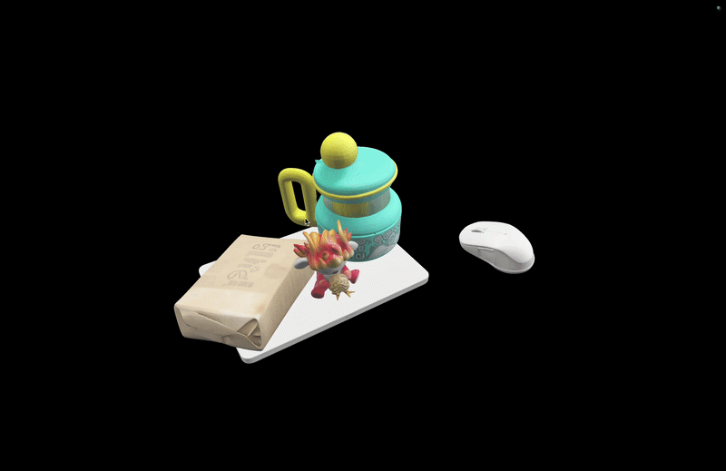
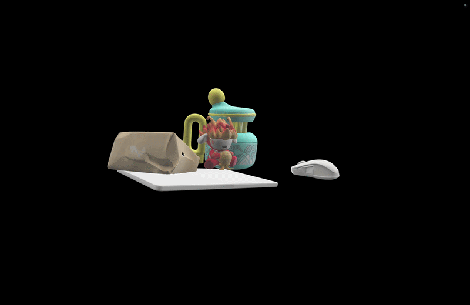
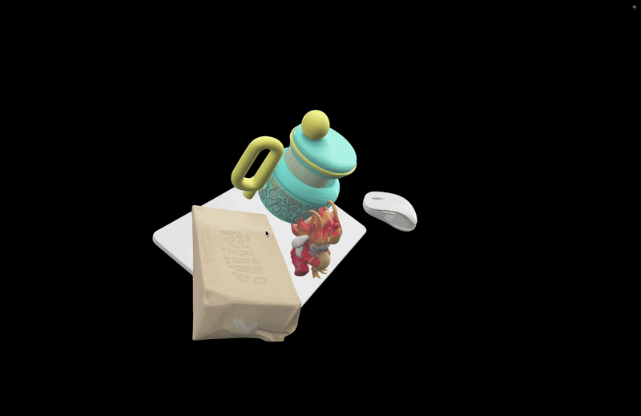

# MV-SAM3D

MV-SAM3D is a multi-view 3D reconstruction framework that extends SAM 3D Objects to leverage observations from multiple viewpoints. It supports both single-object and multi-object generation, and is designed to produce more stable geometry, texture, and scene-level consistency.

## Paper

- arXiv: [https://arxiv.org/abs/2603.11633](https://arxiv.org/abs/2603.11633)

## Installation

Please follow the environment setup from:

- [SAM 3D Objects](https://github.com/facebookresearch/sam-3d-objects)
- [Depth Anything 3](https://github.com/ByteDance-Seed/Depth-Anything-3)

## Data Format

```text
scene/
├── images/
│   ├── 0.png
│   ├── 1.png
│   └── ...
├── object_a/
│   ├── 0.png
│   ├── 1.png
│   └── ...
├── object_b/
│   └── ...
└── ...
```

Mask files are RGBA PNG where alpha indicates foreground.

## Results Comparison

### Single-object

<table>
<tr>
  <td align="center" width="33%"><b>Single-View (View 3)</b></td>
  <td align="center" width="33%"><b>Single-View (View 6)</b></td>
  <td align="center" width="33%"><b>MV-SAM3D</b></td>
</tr>
<tr>
  <td align="center" width="33%" style="padding: 5px;">
    <b>Input Image</b><br>
    
  </td>
  <td align="center" width="33%" style="padding: 5px;">
    <b>Input Image</b><br>
    
  </td>
  <td align="center" width="33%" style="padding: 5px;">
    <b>Input Images</b><br>
    <table width="100%" cellpadding="2" cellspacing="2">
      <tr>
        <td align="center"></td>
        <td align="center"></td>
        <td align="center"></td>
        <td align="center"></td>
      </tr>
      <tr>
        <td align="center"></td>
        <td align="center"></td>
        <td align="center"></td>
        <td align="center"></td>
      </tr>
    </table>
  </td>
</tr>
<tr>
  <td align="center" colspan="3">
    <b>↓ 3D Reconstruction ↓</b>
  </td>
</tr>
<tr>
  <td align="center" width="33%" style="padding: 5px;">
    
    <br><sub>Single-view baseline.</sub>
  </td>
  <td align="center" width="33%" style="padding: 5px;">
    
    <br><sub>Single-view baseline.</sub>
  </td>
  <td align="center" width="33%" style="padding: 5px;">
    
    <br><sub>Better multi-view consistency.</sub>
  </td>
</tr>
</table>

### Multi-object

<table>
<tr>
  <td align="center" width="33%"><b>SAM 3D (single-view)</b></td>
  <td align="center" width="33%"><b>MV-SAM3D w/o Pose Optimization</b></td>
  <td align="center" width="33%"><b>MV-SAM3D (full)</b></td>
</tr>
<tr>
  <td align="center" width="33%" style="padding: 5px;">
    
    <br><sub>Shape and pose are often unstable.</sub>
  </td>
  <td align="center" width="33%" style="padding: 5px;">
    
    <br><sub>Multi-view improves object quality.</sub>
  </td>
  <td align="center" width="33%" style="padding: 5px;">
    
    <br><sub>Improved overall scene alignment.</sub>
  </td>
</tr>
</table>

## Quick Start

### Single-object inference

```bash
python run_inference_weighted.py \
  --input_path ./data/example \
  --mask_prompt stuffed_toy \
  --da3_output ./da3_outputs/example/da3_output.npz
```

### Multi-object inference

```bash
python run_inference_weighted.py \
  --input_path ./data/desk_objects0 \
  --mask_prompt keyboard,speaker,mug,stuffed_toy \
  --da3_output ./da3_outputs/desk_objects0/da3_output.npz \
  --merge_da3_glb \
  --run_pose_optimization
```

## Default Settings (No Extra Flags)

For single-object inference (`run_inference_weighted.py`), key defaults are:

- Stage 1 weighting: enabled (`stage1_entropy_alpha=30.0`)
- Stage 2 weighting: enabled (`stage2_weight_source=entropy`)
- Stage 2 alpha defaults: `stage2_entropy_alpha=30.0`, `stage2_visibility_alpha=30.0`

## Preprocessing for a New Scene

```bash
python preprocessing/build_mvsam3d_dataset.py \
  --input data/your_scene \
  --objects keyboard,speaker,mug,stuffed_toy
```

```bash
python scripts/run_da3.py \
  --image_dir ./data/your_scene/images \
  --output_dir ./da3_outputs/your_scene
```

## Citation

```bibtex
@article{li2026mv,
  title={MV-SAM3D: Adaptive Multi-View Fusion for Layout-Aware 3D Generation},
  author={Li, Baicheng and Wu, Dong and Li, Jun and Zhou, Shunkai and Zeng, Zecui and Li, Lusong and Zha, Hongbin},
  journal={arXiv preprint arXiv:2603.11633},
  year={2026}
}
```

## Acknowledgments

We thank the authors of [SAM 3D Objects](https://github.com/facebookresearch/sam-3d-objects) and [Depth Anything 3](https://github.com/ByteDance-Seed/Depth-Anything-3) for their excellent work.

## License

Please refer to [LICENSE](./LICENSE) for usage terms.
